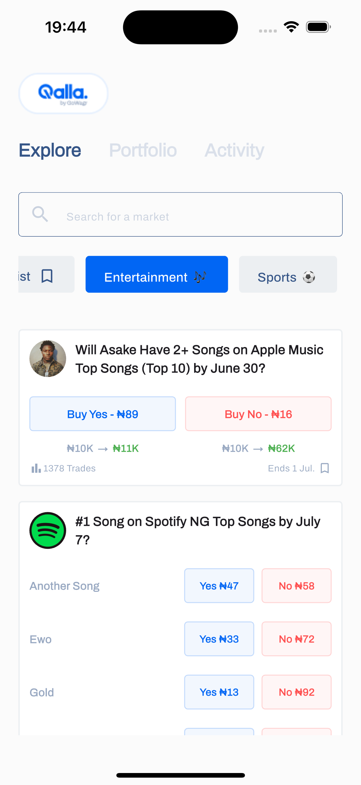

# Gowagr Assessment (Flutter)

A Flutter app built as part of the **Gowagr Mobile Engineer Assessment**. The app fetches and
displays a list of public market events with support for pagination, search, category filtering, and
caching.

---

## ✨ Features

- Fetch events from [Gowagr API](https://api.gowagr.app/pm/events/public-events)
- 🔍 Debounced search for real-time event filtering
- 🏷️ Category chips: Trending, Sports, Entertainment, Watchlist
- 🔁 Pull-to-refresh and infinite scroll
- 📦 Caches events using `SharedPreferences`
- 🔧 Structured using Provider + Clean Architecture
- Error handling with user-friendly feedback

---

## 🧑‍💻 Getting Started

### 1. Prerequisites

Make sure you have:

- Flutter (>=3.x)
- Dart (>=2.x)
- Android Studio / VS Code
- Xcode & CocoaPods (for iOS)

### 2. Clone the Repository

```bash
git clone https://github.com/yourusername/gowagr_assessment.git
cd gowagr_assessment
flutter pub get
flutter run
```

### Project Structure

lib/
├── data/
│ ├── model/ # Data models (Event, Market, Pagination)
│ ├── services/ # API service and error handling
│ └── local_data/ # Repository with shared_preferences
├── provider/ # ExploreViewModel using ChangeNotifier
├── view/ # UI Screens (Explore tab, components)
├── widgets/ # Reusable UI widgets
└── utils/ # Colors, constants, themes

| Package              | Description                 |
|----------------------|-----------------------------|
| `dio`                | API requests and networking |
| `provider`           | State management            |
| `shared_preferences` | Persistent caching          |
| `flutter`            | UI toolkit                  |
| `intl`               | Date formatting             |
| `google_fonts`       | Font selection              |             

---

### ScreenShot


